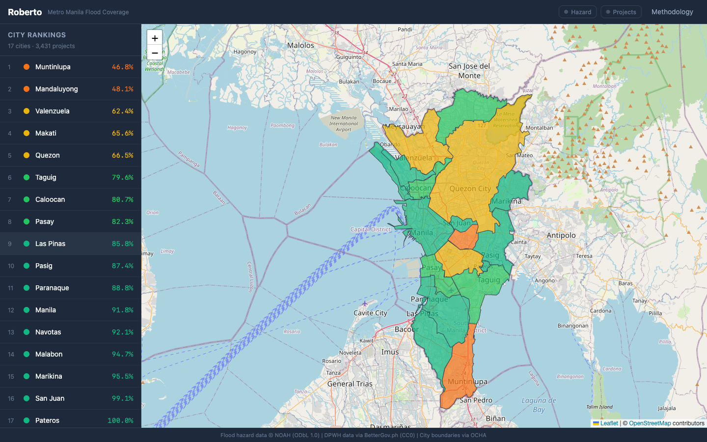
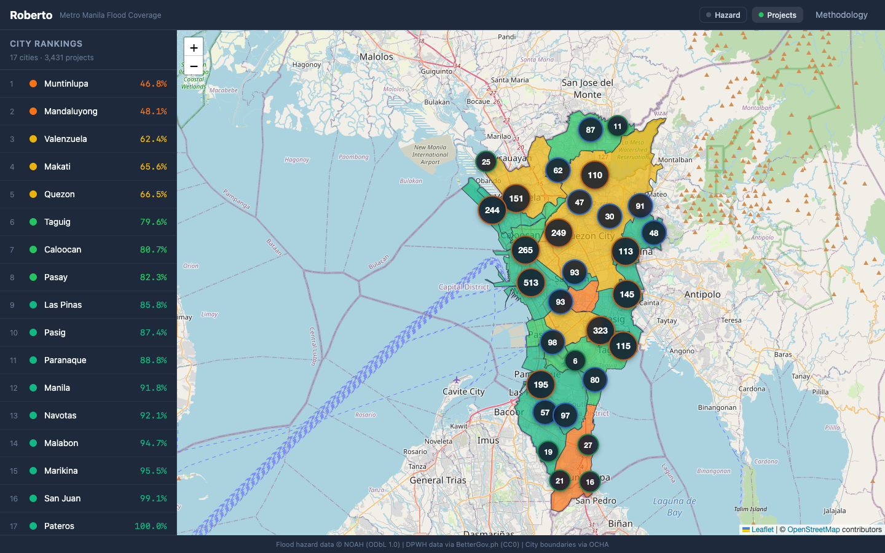
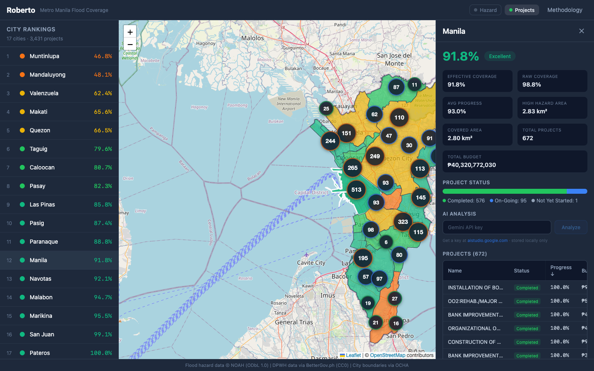
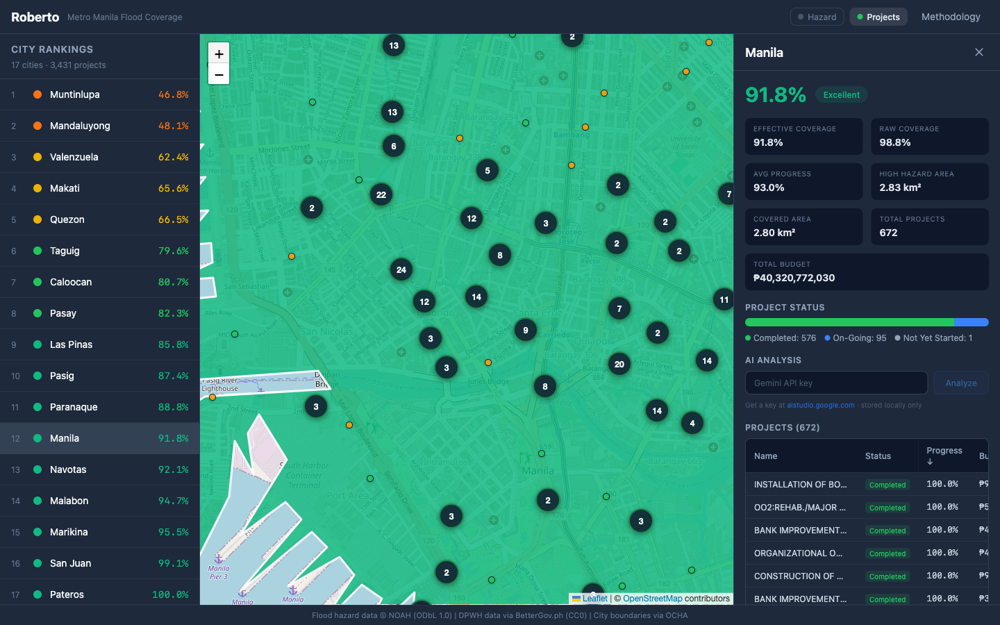
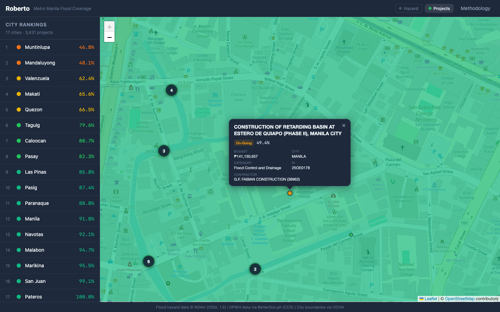

# Roberto

**Metro Manila Flood Coverage Scoring** — Which high-hazard areas are covered by flood-control projects, and which are underserved?

Roberto bridges three public datasets — DPWH flood-control projects, NOAH flood hazard maps, and OCHA city boundaries — to compute per-city **Effective Coverage Scores** across Metro Manila's 17 cities.



## What It Does

Roberto answers a simple question: *if you live in a flood-prone area, how likely is it that a DPWH flood-control project is nearby — and that it's actually finished?*

Each city gets a score from 0–100% based on how much of its high-hazard area falls within range of active flood-control infrastructure, weighted by project completion progress.



### Features

- **Choropleth map** — Cities colored by coverage score (red = critical, green = excellent)
- **Hazard layer toggle** — NOAH 25-year flood hazard polygons (3 severity levels)
- **Project layer toggle** — 3,431 flood-control project locations with marker clustering
- **Project popups** — Click any project dot for full details (name, budget, progress, contractor)
- **City rankings** — Sidebar ranking all 17 cities by score
- **City detail panel** — Metrics grid, project status breakdown, sortable project table
- **AI analysis** — Gemini Flash explains each city's score in plain language (bring your own API key)



## The Score

```
EffectiveCoverage(city) = (raw_covered_area / total_high_hazard_area) × (avg_progress / 100)
```

| Term | Meaning |
|---|---|
| `raw_covered_area` | Area (km²) where 500m project buffers overlap the city's Var=3 hazard zone |
| `total_high_hazard_area` | Total Var=3 (highest severity) flood hazard area in the city |
| `avg_progress` | Mean completion % of all flood-control projects assigned to the city |

A score of **100%** means every square meter of high-hazard area is within 500m of a fully completed project. A score of **50%** could mean half the area is covered by finished projects, or all of it is covered by half-finished ones.

**Current range**: Muntinlupa (46.8%, lowest) to Pateros (100.0%, highest).

### How It's Computed

1. Each DPWH flood-control project is a point (lat/lon). A **500m circular buffer** is drawn around it.
2. All buffers within a city are **unioned** into a single geometry.
3. That union is **intersected** with the city's Var=3 (highest severity) hazard zone.
4. The intersected area is divided by the total hazard area → `raw_coverage_ratio`.
5. Multiplied by `avg_progress / 100` → `effective_coverage_score`.

All spatial math uses **EPSG:32651** (UTM Zone 51N) for accurate area calculations. Storage and display use WGS84.

### Limitations

- ~8.5% of DPWH projects have null coordinates and are silently dropped (316 of 3,925).
- Terminated projects are excluded entirely from scoring.
- The 500m buffer is a fixed assumption — actual project influence varies.
- Only Var=3 (highest severity) hazard is used for scoring.
- Project points don't represent actual infrastructure footprints.

## Data Sources

### DPWH Transparency Data

248,000+ infrastructure project records scraped from the [DPWH Transparency Portal](https://www.dpwh.gov.ph/), published on [BetterGov.ph](https://data.bettergov.ph/datasets/19) under **CC0** license. Filtered to National Capital Region flood-control projects only (3,925 → 3,431 with valid coordinates).

Fields used: project name, lat/lon, budget, status, completion progress, contractor, category.

### NOAH Flood Hazard Maps

25-year return period flood hazard polygons for Metro Manila from the [UP NOAH Center](https://noah.up.edu.ph/). Three severity levels (Var 1, 2, 3). Licensed under **ODbL 1.0** — attribution required.

The raw shapefile (36MB) is simplified during the build pipeline to 0.1MB using topology-preserving simplification + coordinate truncation.

### City Boundaries (OCHA)

Administrative boundary geometries from [OCHA Philippines](https://data.humdata.org/) combined with [faeldon/philippines-json-maps](https://github.com/faeldon/philippines-json-maps). 17 Metro Manila city/municipality polygons.

## Tech Stack

| Layer | Technology |
|---|---|
| Frontend | React 19, Vite, Leaflet, Tailwind CSS 4 |
| Backend | Express 5, TypeScript |
| Data Pipeline | Python, GeoPandas, Shapely |
| AI | Google Gemini 2.0 Flash (user-provided API key) |
| Map | OpenStreetMap tiles, react-leaflet, react-leaflet-cluster |
| Deployment | Render (free tier) |

### Why Python for spatial ops?

Turf.js `union()` has a [documented 10–100x performance regression](https://github.com/Turfjs/turf/issues) in v7.2+. GeoPandas handles buffer → union → intersect → area computation for 3,500 projects in ~60 seconds.

### Why not server-side API keys?

Users bring their own Gemini API key. It's stored in `localStorage` only — never persisted on the server. This means zero API cost for deployment and no key management.

## Project Structure

```
roberto/
├── client/                 # React + Vite SPA
│   └── src/
│       ├── components/     # ChoroplethMap, CityRanking, CityDetail, AIAnalysis, Methodology
│       ├── hooks/          # useCities, useCity
│       └── lib/            # API client, types, color utilities
├── server/                 # Express 5 API
│   └── src/
│       ├── routes/         # cities, projects, boundaries, hazard, meta, analysis
│       ├── data-store.ts   # Runtime-validated data loading
│       └── analysis-service.ts  # Gemini integration
├── pipeline/               # Python build pipeline
│   ├── build.py            # Spatial processing + score computation
│   └── validate.py         # 30-check validation suite
├── data/                   # Pre-computed JSON/GeoJSON (generated by pipeline)
├── Makefile                # Dev commands
└── render.yaml             # Render deployment config
```

## Getting Started

### Prerequisites

- Node.js 20+
- Python 3.10+ with GeoPandas (only if regenerating data)

### Quick Start

```bash
# Install dependencies
make install

# Start dev servers (client on :5173, server on :3001)
make dev
```

### Available Commands

```bash
make install     # Install all dependencies
make dev         # Start client + server in dev mode
make build       # Full production build
make start       # Run production server
make typecheck   # Type-check both client and server
make pipeline    # Run Python data pipeline (regenerate data/)
make validate    # Run 30-check pipeline validation
make clean       # Remove build artifacts
```

### Production Build

```bash
make build && make start
# Server runs on port 3001 (or PORT env var)
# Serves both API and built frontend
```

## Deployment

Roberto is configured for [Render](https://render.com) free tier:

1. Push to GitHub
2. Render → New → Web Service → connect the repo
3. `render.yaml` auto-configures build + start commands
4. No environment variables needed (AI keys are user-provided)

## Project Markers & Clustering



Projects are clustered using `react-leaflet-cluster` (wrapping Leaflet.markercluster). Clusters break apart as you zoom in. Individual project dots are color-coded by status:

- **Green** — Completed
- **Amber** — On-Going
- **Gray** — Not Yet Started

Click any dot for full project details:



## License

Data licenses: DPWH data (CC0), NOAH flood hazard (ODbL 1.0), OCHA boundaries (public domain).
